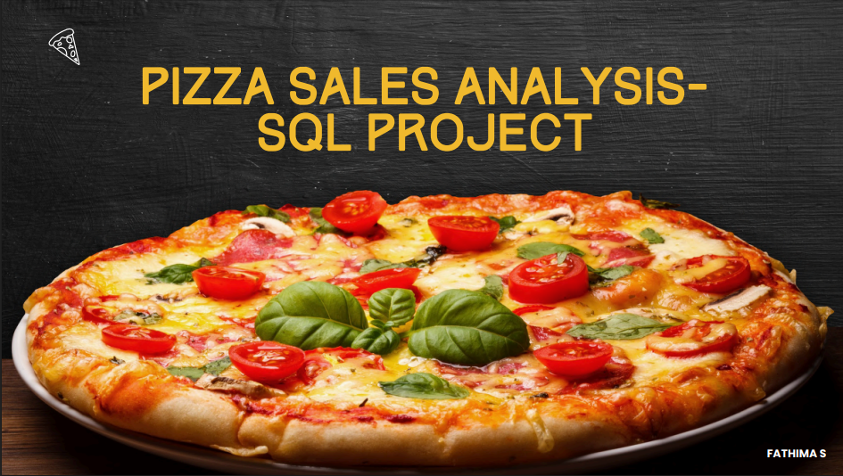

# Pizza_sales_Analysis_SQL-Project
# 🍕 Pizza Sales Analysis

## 📌 Project Overview
This project analyzes pizza sales data to uncover key business insights.  
We use SQL queries ranging from beginner-level to complex analytical queries to answer questions about sales trends, customer preferences, and operational performance.

The goal is to help stakeholders make **data-driven decisions** for improving sales and customer satisfaction.

## 📄 Full Report

*Click the image to view the full Pizza Sales Analysis Report (PDF).*

## 📊 Dataset
The dataset contains the following tables:

- **orders** – Order ID, Order Date, Time, Customer ID
- **order_details** – Order Detail ID, Order ID, Pizza ID, Quantity
- **pizzas** – Pizza ID, Pizza Type ID, Size, Price
- **pizza_types** – Pizza Type ID, Name, Category, Ingredients

---

## 🛠 Tools Used
- **SQL** – Querying and data analysis
- **MySQL / PostgreSQL** – Database engine
-

